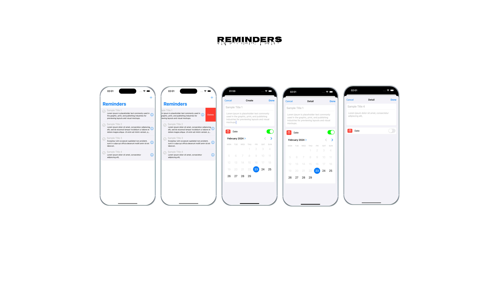

# Reminder

## Built With
- [Swift](https://developer.apple.com/swift/)
- [UIKit](https://developer.apple.com/documentation/uikit)

  

  Build a three-paged to-do list app that is similar to Apple's native Reminder app.
  It will have two screens. The first one is the list screen includes to-dos with their description, date, and time. Each to-do has a check button to make it completed.
  By tapping the plus(create) button, the create to-do screen opens. Users can define a description, date, and time on the to-do. A create button provides saving the to-do and it will be seen in the list on the list screen.
  In case the user taps on one of the to-dos, the detail page shows, and the user can edit the to-do.

## Goals

- Understand MVVM by separating logic between controller and view model
- Learn to implement table view
- Integrate third-party library
- Build UI programmatically in controller
- Use model(such as ToDo) with Codable
- Use UserDefaults to fetch and save data locally

## 
Architecture
- Use simple MVVM. No need to use protocols for now. Do not forget that you must not import UIKit in the view model.

## 
Responsive Design

- Integrate SnapKit via SPM and build UI programmatically. No need to use any Storyboard od xib files
- Use table view in the list screen
- You are free to build UI as you wish
- Logic

Implement Codable to your To-Do model and store to-dos as an array in local by using UserDefaults.

## Keywords

- MVVM
- Table view
- Codable
- SPM
- SnapKit
- UserDefaults
- Tips

Thanks for idea https://github.com/meyusufdemirci .
